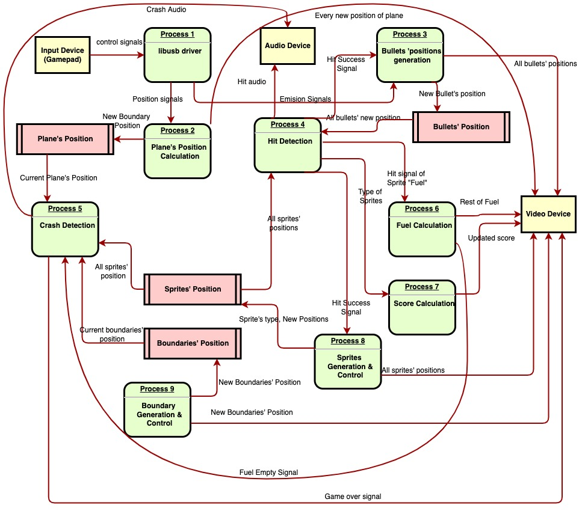

# Water-Raid

This project aims to create a game similar to "River-Raid" on DE1-SoC board. We will develop our own software, drivers and hardware to finally display the game through VGA signals, deliever the audio content through speakers, and allow players to control through specific USB hardware.

## [Suggestions on commit message](https://gist.github.com/robertpainsi/b632364184e70900af4ab688decf6f53)

For a midium to large project, there may have tens of hundreds of commits. We don't need to have perfect commit messages, but good commit messages can help us understand what we did and how we rollback if neccessary.

## Suggestions on push and pull requests

1. Always pull before editing, so you can synchronize the updates and do not need to resovle conflicts.
2. Please never use force push. This command will remove all history records. I have added a rule for the main branch so if you do force push unintentionally, it will not cause a problem. If there is a conflict, resolve it before pushing it.
3. Every time to push a request, remember to write the commit message, even only with subjects.

## Requirement Analysis (Data Flow Diagram)

Input Device: it can send control signals containing changing the position of the plane and emitting bullets.

Output Devices: we will output the video signals through self-designed hardware and audio signals through some speakers.

Objects:

1. The Plane.
2. All kinds of different sprites.
3. Bullets sent from the plane.
4. Boundaries of the background.
5. Fuels of the plane.
6. Scores of the game.