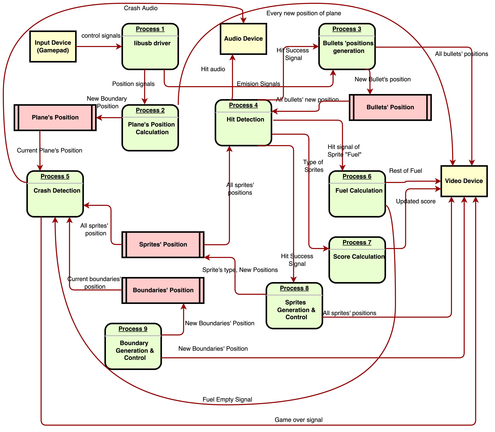

# Water-Raid

This project aims to create a game similar to "River-Raid" on DE1-SoC board. We will develop our own software, drivers and hardware to finally display the game through VGA signals, deliever the audio content through speakers, and allow players to control through specific USB hardware.

## [Suggestions on commit message](https://gist.github.com/robertpainsi/b632364184e70900af4ab688decf6f53)

For a midium to large project, there may have tens of hundreds of commits. We don't need to have perfect commit messages, but good commit messages can help us understand what we did and how we rollback if neccessary.

## Suggestions on push and pull requests

1. Always pull before editing, so you can synchronize the updates and do not need to resovle conflicts.
2. Please never use force push. This command will remove all history records. I have added a rule for the main branch so if you do force push unintentionally, it will not cause a problem. If there is a conflict, resolve it before pushing it.
3. Every time to push a request, remember to write the commit message, even only with subjects.
4. If you find that you cannot push something, it may because the local version is not compatible with the remote version, which means that you need to merge first, then push.

## Requirement Analysis (Data Flow Diagram)

Input Device: it can send control signals containing changing the position of the plane and emitting bullets.

Output Devices: we will output the video signals through self-designed hardware and audio signals through some speakers.

Objects:

1. The Plane.
2. All kinds of different sprites.
3. Bullets sent from the plane.
4. Boundaries of the background.
5. Fuels of the plane.
6. Scores of the game.

## Naming Standard in this project

1. All names of classes and structs are capitalized and use CamelCase.
2. All names of variables and functions use CamelCase with non-capitalized first letter.

## Result for this project

Finally we have nearly reproduced the whole game, even including some detailed animation. Here is the demo picuture about our system. 

We have a DE1-SoC board which locates in the bottom right corner to serve for the main processing unit. To control the plane to move left or right, we use the Xbox Controller to do it. The "X" and "B" controls left and right, while "Y" emits the bullets, and "A" start the game. We used hardware to generate the graphical signals and send out using VGA signal.

To view the demo video about how the game actually work, please find the video in the diagram folder named "demo.MOV".

The game logic is, the plane can only move left or right, while the screen is scrolling, meaning that the plane is continuously moving on. As time flies, the plane is consuming fuel, and it should collect some during the fly. The indicator above the screen shows how much fuel is left. Every time we shoot an enemy target, we can get certain scores. The higher the score, the better you have done.

## structure of the project

**GameLogic** folder contains all code related to the game logic and high level driver. Thus, if you can realize the graphic generation in the driver.c file according to the specific hardware and software environment, you can transplant this system to anywhere else you like.

**VideoDriver** folder contains the Linux kernel module for our dedicated hardware. Both the video and audio driver is implemented here.

**XboxDriver** folder contains Linux kernel module for Xbox controller. Actually, this module is derived from another GitHub project called "xpad" developed by paroj. We modified some part to improve the user experience.

**hardware** folder contains all files generated when developing hardware. However, the most important file is the "vga_ball.sv" under the hardware folder. it contains all the video and audio hardware design and implementation. The other folders contains some necessary files for implementing the hardware, like audio files, RAM and ROM.

## Thankfulness to all members

Even though we have expressed it many times, but I still want to say it again formally. Thanks for everyone's great effort on this project, so we can produce such an amazing product. I hope everyone of us have learned some precious experience from this project, and have a bright future. -- By Yongmao